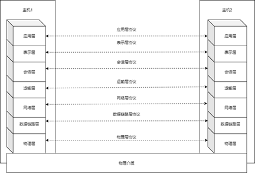
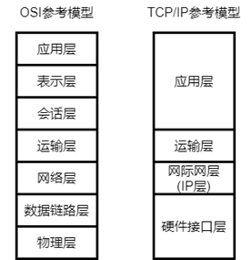
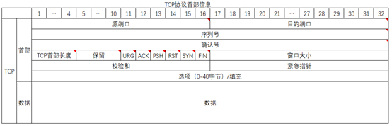
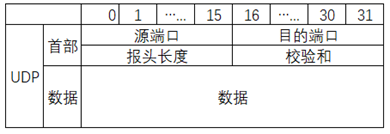

# UDP协议会话层技术研究

# 摘 要

​	文章研究的UDP协议会话层研究，主要应用UDP协议的特点研究可靠传输、不可靠传输、消息传递一致性、多点通信、分布式计算和分布式系统通信等问题的底层传输研究。

​    经过长时间的大数据开发学习，HDFS、Yarn、MapReduce、Spark和Zookeeper等其他系统到的网络通信给我很大的感触，大部分的网络通信协议还是基于运输层可靠传输协议TCP、不可靠传输协议UDP协议和远程过程调用RPC协议等（本文参考OSI七层网络体系结构）。UDP协议在传输层中只是对IP协议的进行了数据校验、复用和分用的功能，研究UDP协议的会话层通信对分布式服务和分布式计算是一个里程碑的意义。

​    研究UDP协议会话层主要是会话层对应用程序的业务更加切近，文章将介绍UDP协议会话层完成IP层的单播、多播、组播、可靠单博、可靠多播、可靠多对多通信、不可靠多对多通信和面向字节传输等问题。

​    同时UDP协议在会话层的研究会改变传统对网络分层中会话层的概念，文章只会讨论传输层及传输层以上的网络层和应用方向，不会过多的辩论网络层以下的网络分层。带你深入的了解可靠传输单播、可靠传输多播、可靠传输组播、可靠传输的多对多的实现和分布式计算的研究。

​    在UDP协议的会话层当然也可以使用TCP协议和其他传输层以上协议的整合应用。在应用方面上，可以做到时时变化的IP地址及随时变化端口之间做到可靠通信，弥补计算机的IP地址的原因所做成的网络缺陷。

关键词：UDP协议，会话层，多对多可靠传输，分布式系统通讯 

 

# ABSTRACT

The research on the session layer of the UDP protocol studied in this article mainly uses the characteristics of the UDP protocol to study the underlying transmission research of reliable transmission, unreliable transmission, message consistency, multi-point communication, distributed computing and distributed system communication.

After a long time of big data development and learning, the network communication from other systems such as HDFS, Yarn, MapReduce, Spark and Zookeeper gave me a great feeling. Most of the network communication protocols are still based on the transport layer reliable transmission protocol TCP, unreliable transmission Protocol UDP protocol and remote procedure call RPC protocol, etc. (this article refers to the OSI seven-layer network architecture). The UDP protocol in the transport layer only performs data verification, multiplexing and demultiplexing of the IP protocol. The study of the session layer communication of the UDP protocol is a milestone for distributed services and distributed computing.

The study of the UDP protocol session layer is mainly because the session layer is closer to the business of the application. The article will introduce the UDP protocol session layer to complete the IP layer unicast, multicast, multicast, reliable single blog, reliable multicast, and reliable many-to-many communication , Unreliable many-to-many communication and byte-oriented transmission.

At the same time, the study of the UDP protocol in the session layer will change the traditional concept of the session layer in the network layer. The article will only discuss the transport layer and the network layer and application directions above the transport layer. Floor. Take you in-depth understanding of reliable transmission of unicast, reliable transmission of multicast, reliable transmission of multicast, reliable transmission of many-to-many realization and distributed computing research.

The session layer of the UDP protocol can of course also use the integrated application of the TCP protocol and other protocols above the transport layer. In terms of application, reliable communication can be achieved between constantly changing IP addresses and changing ports at any time, so as to compensate for the network defects caused by the computer's IP address.

 

Keywords: UDP protocol, session layer, many-to-many reliable transmission, distributed system communication

# 第一章 绪论

## 1.1 研究背景

​	 伴随的大数据和人工智能的发展和人们对互联网的需求，大力的推进了计算机网络的开发，21世界最耀眼的5G时代，给予我们网络传输速率的同时，也开启了物联网时代的新年代。对于传统的一对一通信方式变量成了一对多、多对多的通讯方式。更多的时候我们需要时时的数据进行交互，这些需求伴随IP v6的产生也将会得到很大的发展空间。计算机网络的发展同时在传输层TCP/IP协议的支持上开发得有各种传输协议，如HTTP、SSL、RUDP和DNS等协议。

​	计算机网络是一个非常复杂的系统，相互通讯的两个计算机系统必须高度协调工作才行，对于这种的“协调”是相当的复杂的。计算机网络体系的“分层”将庞大又复杂的问题，每一层完成自己单一业务功能和上下层协调。为了使得不同的“分层”体系结构在计算机网络中互联互通。国际化标准组织ISO在1977年开始研究该问题。提出了计算机在世界范围内互联成网的标准框架，也就是著名的开放系统互连参考模型OSI/RM（Open Systems Interconnection Reference Model），简称计算机网络OSI模型。如图1-1所示

图1-1

之所以抛出TCP/IP协议体系和五层协议体系结构选择在OSI体系结构中研究UDP协议在会话层呢？是因为TCP/IP协议体系和五层协议体系大部分都是建立在TCP协议之上直接面向应用层开发，所以在这里为了规避TCP协议，我们面向OSI体系结构开发会话层。

## 1.2 UDP协议发展现状

​    UDP协议的最初规范的时间是在1980年发布的RFC768文档中说明的。距离2020年时隔很久了，虽然UDP协议是面向无连接的不可靠传输，但是依旧是网络中不能或缺的部分，在视频、音频和网络游戏中充当的重要的角色。

​    同时在UDP协议在工业领域同样有基于UDP协议变化而来的可靠传输协议，如SRUDP、RUDP协议。在其他领域中，基于UDP协议之上的还有RTP（Real Time Protocol），RTP为数据提供了具有实时性特征的端到端的数据服务，比如在组播或者单播网络层下的交互式视频和音频或者模拟信号。应用程序通常在UDP协议上运行的RTP，为路节点和校验服务。UDT（UDP-based Data Transfer Protocol）基于UDP的数据传输协议（UDP-based Data Transfer Protocol，简称UDT）是一种互联网数据传输协议。UDT的主要目的是支持高速广域网上的海量数据传输，而互联网上的标准数据传输协议TCP在高带宽长距离网络上性能很差。

​    对于这些基于UDP协议开发的传输协议，满足不了本文章中的需求。基于这现状，本文介绍UDP协议会话层的可靠传输，完成多对多的可靠传输，灵活多用的UDP协议会话层传输方式。

 

## 1.3 研究意义

### 1.3.1 UDP协议会话层数据传输

​    UDP协议的会话层数据传输，包括一对一可靠传输，一对多可靠传输、多对多可靠传输、一对一不可靠传输、一对多不可靠传输、多对多不可靠传输。在可靠传输与不可靠传输的过程中，在实现可靠传输的过程中实现拥塞控制和数据分组排序，在不可靠传输的过程中尽力实现拥塞控制机制。

​    通过灵活的数据报头变换，来解决分布式系统通信的问题，如心跳监测、监控、服务转义、数据传递一致性等问题。

### 1.3.2 分布式数据传输底层协议

​    作为解决大文件传输到分布式系统中的底层协议基础，提高数据传递的多渠道。同时能对分布式的数据在多对一传输的过程中实现数据的排序和拥塞控制。

实现数据在传输的分离和数据的聚和。

## 1.4 论文组织安排

​    第一章介绍论文的题目和开发背景及开发意义。

​    第二章介绍计算机网络传输层的两大协议TCP、UDP协议，对两个协议进行比较。

​    第三章主要介绍UDP协议会话层可靠传输设计分析，主要的新概念有会话与子会话，实现多对多可靠传输中的数据报头，及会话群中的“滑动窗口”和拥塞控制方案。

​    第四章主要介绍的是使用面向对象的设计方式，通过Java实现UDP协议会话层的可靠传输。

​    第五章主要的介绍是程序的测试与分析，主要测试的UDP协议在会话层中的拥塞控制、传输速率和传输的可靠性。

​    第六章主要介绍的是基于当前论文基础上应用领域，在本片文章中并没有实现。

​    第七章介绍的是本片论文报头设计方式和程序的设计方式，包括分布式集群中的通讯探讨。

# 第二章 传输层协议

 

## 2.1 计算机网络参考模型

​    计算机网络的参考模型中，除了上章节介绍的OSI参考模型以外，还有常见的基于TCP/IP参考模型，两个参考模型如下图2-1所示。

图2-1

TCP/IP协议参考模型中，把OSI参考模型中的数据链路层和物理层统称为硬件接口层，TCP/IP协议在传输层和运输层对于的是OSI参考模型中一样的。

## 2.2 TCP协议

  传输层的TCP协议的主要特点是：1、TCP协议是面向连接的运输层协议。2、每一条 TCP 连接只能有两个端口进程，每一条TCP连接只能是点对点的（一对一）。3、TCP 提供可靠交付的服务。3、TCP 提供全双工通信。4、面向字节流。TCP协议的数据报如图2-1所示。

图2-1

TCP协议是面向连接的可靠传输协议，主要通过以下的几个机制：

**1、** **停止等待协议**

“停止等待”就是每发送完一个分组就停止发送，等待对方的确认。在收到确认后再发送下一个分组。全双工通信的双方既是发送方也是接收方。

 

**2、** **连续ARQ协议**

为了克服停止并等待ARQ协议长时间等待ACK的缺点。这个协议会连续发送一组数据包，然后再等待这些数据包的ACK.

回退N重传(Go-Back-N)

接收点丢弃从第一个没有收到的数据包开始的所有数据包。

发送点收到NACK后，从NACK中指明的数据包开始重新发送。

选择重传(Selective Repeat)

发送点连续发送数据包但对每个数据包都设有个一个计时器。

当在一定时间内没有收到某个数据包的ACK时，发送点只重新发送那个没有ACK的数据包。

 

**3、** **建立连接**（假设A向B发起连接）

a) A的TCP向B发出连接请求报文段,其首部中的同步位SYN=1,并选择序号seq=x，表明传送数据时的第一个数据字节的序号是 x。

b) B的TCP收到连接请求报文段后，如同意，则发回确认。B在确认报文段中应使SYN=1，使ACK =1，其确认号ack=x+1，自己选择的序号seq=y。

c) A收到此报文段后向B给出确认其ACK=1，确认号ack=y+1。A 的TCP通知上层应用进程,连接已经建立。

d) B的TCP收到主机A的确认后，也通知其上层应用进程：TCP 连接已经建立。

 

**4、** **释放连接**

a) 数据传输结束后，通信的双方都可释放连接,现在A的应用进程先向其TCP发出连接释放报文段，并停止再发送数据，主动关闭TCP连接。A把连接释放报文段首部的FIN=1，其序号seq=u，等待B的确认。

b) B发出确认，确认号ack=u+1，而这个报文段自己的序号seq=v。TCP服务器进程通知高层应用进程。从A到B这个方向的连接就释放了，TCP连接,处于半关闭状态。B若发送数据，A仍要接收。

c) 若B已经没有要向A发送的数据，其应用进程就通知TCP释放连接。

d) A收到连接释放报文段后，必须发出确认。在确认报文段中ACK=1，确认号ack=w+1，自己的序号seq=u+1。

 

**5、** **拥塞控制**

TCP 采用基于窗口的方法进行拥塞控制。该方法属于闭环控制方法。

TCP发送方维持一个拥塞窗口 CWND (Congestion Window),拥塞窗口的大小取决于网络的拥塞程度，并且动态地在变化。发送端利用拥塞窗口根据网络的拥塞情况调整发送的数据量。所以，发送窗口大小不仅取决于接收方公告的接收窗口，还取决于网络的拥塞状况，所以真正的发送窗口值为：真正的发送窗口值 = Min(公告窗口值，拥塞窗口值)。

## 2.3 UDP协议

​    传输层的UDP协议相对网络层的IP协议在数据报服务上增加了两大特点：1、复用和分用的功能，2、提供了差错检验的功能。UDP协议在传输层虽然数据报没有可靠交互的特点。

但是UDP协议在运输层中有下面的几个特点：1、是无连接的，发送数据之前不需要建立连接，因此减少了开销和发送数据之前的时延。2、使用尽最大努力交付，即不保证可靠交付，因此主机不需要维持复杂的连接状态表。3、UDP协议是面向报文的，UDP协议对传输层以上交下来的报文，既不合并，也没有拆分，而是保留这些报文的边界，UDP 一次交付一个完整的报文。4、没有拥塞控制，因此网络出现的拥塞不会使源主机的发送速率降低，这对某些实时应用是很重要的，很适合多媒体通信的要求。5、支持一对一、一对多、多对一和多对多的交互通信。6、TCP协议数据报的首部开销小，只有八个字节，比TCP协议的20个字节的首部。TCP的数据报如图2-2所示。

图2-2

## 2.4 传输层协议对比

​    在上面我们介绍了TCP协议和UDP协议，对于分布式计算中，TCP协议显得格外很笨重，而且在传输方面的缺点就是不能实现一对多或者多对多的传输，对于尽力服务如心跳监测等问题上，变得更加的繁琐。所以可见UDP协议的改造型比TCP协议改造性更强。本论文主要介绍从会话层的角度建立会话群聊。实现多对多可靠通信，而且是边发送数据边接受数据的解决方案。